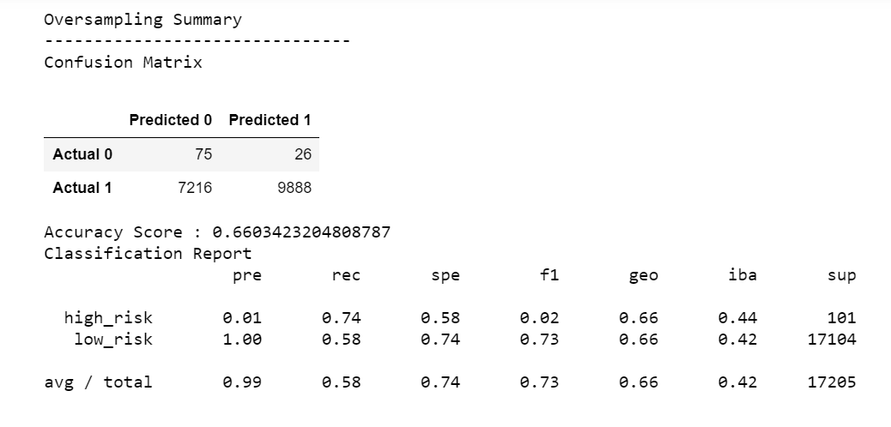
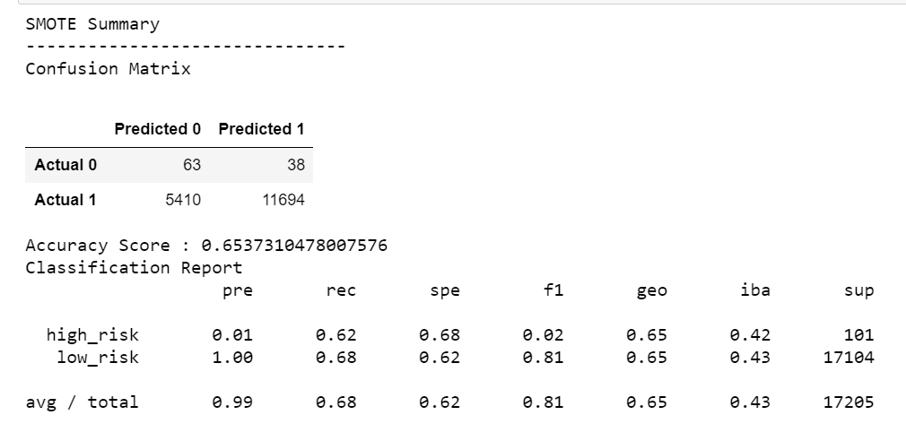
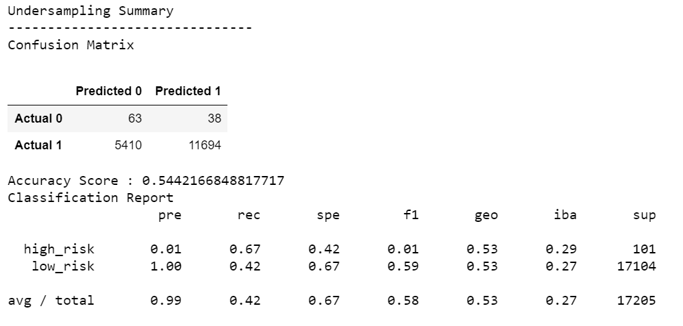
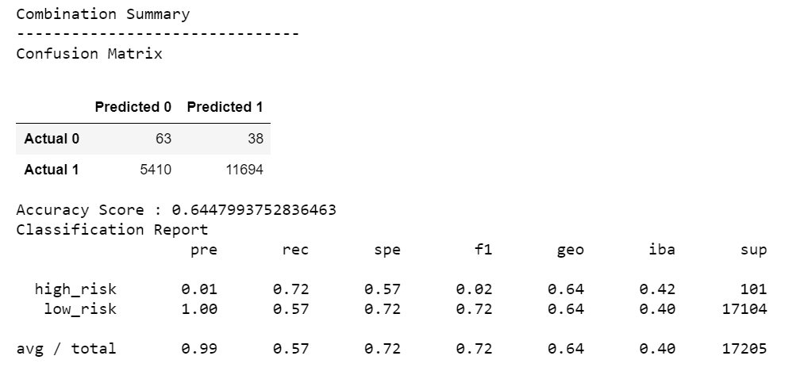

# Supervised Machine Learning
This challenge we are leaning supervised machine learning with different types of resampling techniques. We used the Python's numpy, SciPy and Scikit-learn packages for differet sampling techniques. We have used Supervised machine leaning for this module challenge. Supervised learning deals with labeled data. This challenge explores different types if sampling techniques to train the model. And compares the accuracy of the models with each to indentify which model performs better than other models. 

### Type of Resampling Techniques used to check the accuracy of model
* Oversampling
* SMOTE Oversampling
* Unsersampling
* Combination (Over and Under) Sampling

### Flow
We have used LoanStats_2019Q1.csv file for data sampling. Cleaned the data, used 'loan_sample' as y (target) and rest as X. Then trained model on X and y and then used different types of sampling techniques to findout accuracy, cofusion matrix and generate classification report. According to our data, its not even there are more 'low_risk' loan samples than 'high_risk' loan samples. Counter({'low_risk': 51366, 'high_risk': 246}). 

### Oversampling
Using RandomOverSampler from imlearn we resampled the data to match class of less sample data with class of more sample data and its summary is as below. According to summary precision is very low (0.01) for low data class (high_risk) and high (1.00) for high data class (low_risk). Recalls are high for high_risk loans that is 0.74 and low for low_risk loans 0.58. Accuracy score is 0.66.

### SMOTE Oversampling
Using SMOTE from imlearn we resampled the data to match class of less sample data with class of more sample data and its summary is as below. The SMOTE is increated size of minority is increaed by interpolating new instances. For example instance from the minority class, a number of its closest neighbors is chosen. Based on the values of these neighbors, new values are created. By using this technique model accuracy is 0.65. According to summary precision is very low (0.01) for low data class (high_risk) and high (1.00) for high data class (low_risk), which is same as Oversampling. Difference between Recalls hish_risk and low_risk samples are not much, high_risk is 0.62 and low_righ is 0.68.

### UnderSampling
Using ClusterCentroids from imlearn we resampled the data to match class of less sample data with class of more sample data and its summary is as below.In Undersampling instead of increasing the number of the minority class, the size of the majority class is decreased. Original: Counter({'low_risk': 51366, 'high_risk': 246}), After Undersampling Counter({'high_risk': 246, 'low_risk': 246}). By using this technique model accuracy is 0.54. According to summary precision is very low (0.01) for low data class (high_risk) and high (1.00) for high data class (low_risk). Recall for high_risk data samples 0.67 and for low_risk its 0.42 low. f1 score is also very bad 0.01

### Combination ()
Using SMOTEENN from imlearn we resampled the data to match class of less sample data with class of more sample data and its summary is as below. SMOTEENN combines the SMOTE and Edited Nearest Neighbors (ENN) algorithms. First it oversample the minority class with SMOTE, second clean the resulting data with an undersampling strategy. By using this technique model accuracy is 0.64.  According to summary precision is very low (0.01) for low data class (high_risk) and high (1.00) for high data class (low_risk). REcalls for high_risk (0.72) higher than low_risk (0.57). f1 score is still bad 0.02 high_risk and good for 0.72 low_risk.

### Summary And Analysis
By looking at the summary for all sampling techniques none of the sampling technique looks clearly better than other. All of them almost equal. For sure undersampling is worst as its accuracy score is just 0.54 and f1 score 0.01 is also bad.
By looking at remaining 3 model techniques (combination, oversamplting, SMOTE) oversampling has highest accuracy which is 0.66. f1 score for high_risk is bad which is 0.02 but its same as for rest 3 models. Precision TP/(TP + FP):
Oversmapling : for high_risk loan are 75/(75 +  7216) = 0.01 and 26/(26+9888) = 0.002. 
SMOTE: high_risk: 63/ (63 + 5410) = 0.011, and for low_risk: 38/ (38 + 11694) = 0.002
Combination: high_risk: 63/ (63 + 5410) = 0.011, and for low_risk: 38/ (38 + 11694) = 0.002
Low value of precision shows that there will be high number of false positive.
Recall TP/(TP + FN):
Oversampling: high_risk: 75/ (75 + 26) = 0.74, low_risk 7216/(7216 + 9888) = 0.42.
SMOTE: high_risk:  63/ (63 + 38) = 0.62, low_risk: 5410 / (5410 + 11694)= 0.31
Combination: 63/ (63 + 38) = 0.62, low_risk: 5410 / (5410 + 11694)= 0.31

Summary shows that Oversampling has recall 074 and 0.42 which is more than SMOTE and Combination. Precision is same for all of them. Accuracy is little bit more for Oversampling model technique. So we can go with Oversamping model technique.

